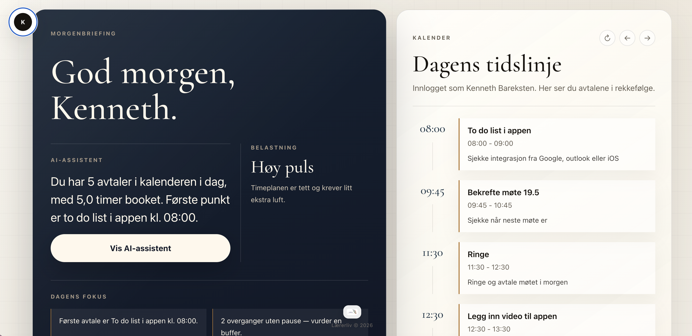
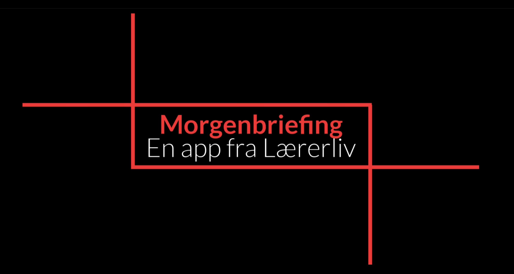

# Morgenbriefing

En personlig morgenassistent som leser Google Kalender og lager en kort, saklig dagsoversikt med hjelp av Gemini AI.

Appen viser hva som skjer de neste dagene og genererer en kort tekst med konkrete prioriteringer — uten heiarop, uten selvfølgeligheter.

---

## Skjermbilder

<!-- Legg til skjermbilder her -->
<!--  -->

---

## Video

<!-- Legg til demo-video her -->
<!-- [](https://youtu.be/din-video-id) -->

---

## Teknologi

- [Next.js](https://nextjs.org/) (App Router)
- [NextAuth.js](https://next-auth.js.org/) med Google OAuth
- [Google Calendar API](https://developers.google.com/calendar)
- [Gemini API](https://ai.google.dev/) (gemini-flash-lite)
- [Tailwind CSS](https://tailwindcss.com/)

---

## Sett opp selv

### 1. Klon og installer

```bash
git clone https://github.com/barx10/morgenbriefing-public.git
cd morgenbriefing-public
npm install
```

### 2. Google OAuth og Kalender-tilgang

1. Gå til [Google Cloud Console](https://console.cloud.google.com/)
2. Opprett et nytt prosjekt (eller bruk et eksisterende)
3. Aktiver **Google Calendar API** under *APIs & Services → Library*
4. Gå til *APIs & Services → Credentials* og klikk **Create Credentials → OAuth client ID**
   - Application type: **Web application**
   - Authorized redirect URIs: `http://localhost:3000/api/auth/callback/google` (og din produksjons-URL)
5. Kopier **Client ID** og **Client Secret**

### 3. Gemini API-nøkkel

1. Gå til [Google AI Studio](https://aistudio.google.com/app/apikey)
2. Opprett en ny API-nøkkel

### 4. Miljøvariabler

Opprett en `.env.local`-fil i prosjektmappen:

```env
GOOGLE_CLIENT_ID=din-client-id.apps.googleusercontent.com
GOOGLE_CLIENT_SECRET=din-client-secret

GEMINI_API_KEY=din-gemini-nøkkel

NEXTAUTH_SECRET=en-tilfeldig-lang-streng
NEXTAUTH_URL=http://localhost:3000
```

Generer `NEXTAUTH_SECRET` med:

```bash
openssl rand -base64 32
```

### 5. Start lokalt

```bash
npm run dev
```

Åpne [http://localhost:3000](http://localhost:3000) og logg inn med Google.

---

## Deploy til Vercel

1. Push koden til GitHub
2. Importer repoet på [vercel.com](https://vercel.com)
3. Legg til miljøvariablene under *Settings → Environment Variables*
   - Husk å sette `NEXTAUTH_URL` til din Vercel-URL (f.eks. `https://morgenbriefing.vercel.app`)
4. Legg til Vercel-URLen som authorized redirect URI i Google Cloud Console

---

## Lisens

MIT
